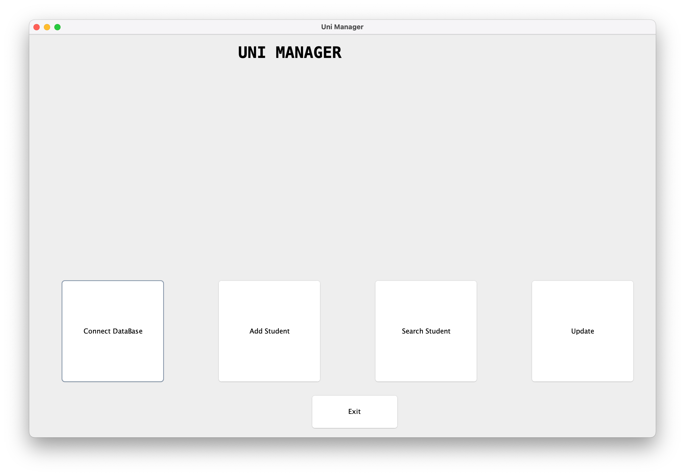
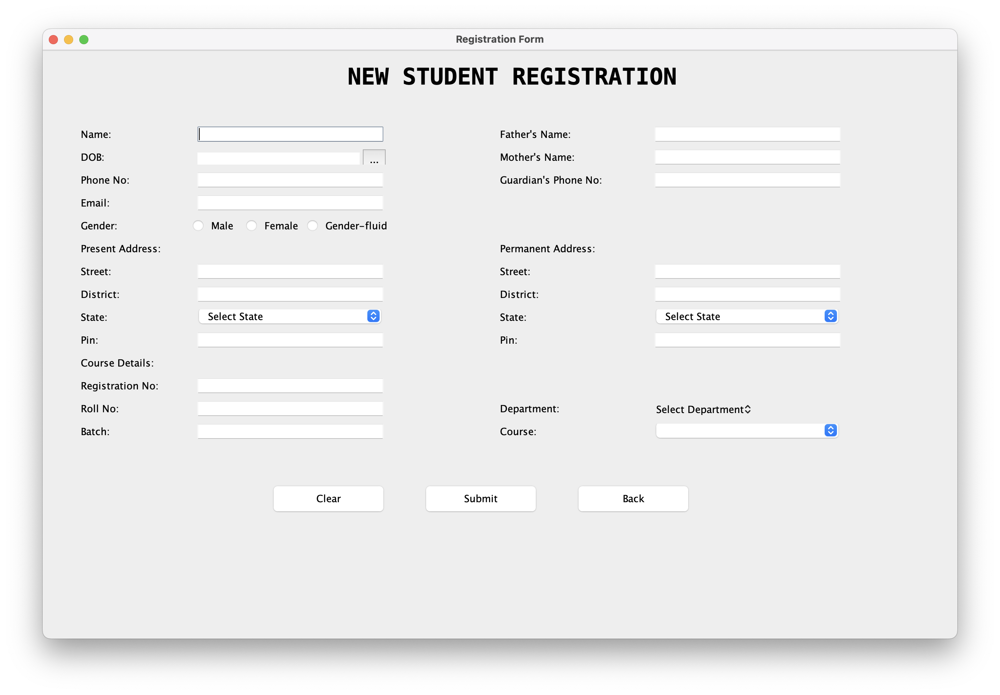
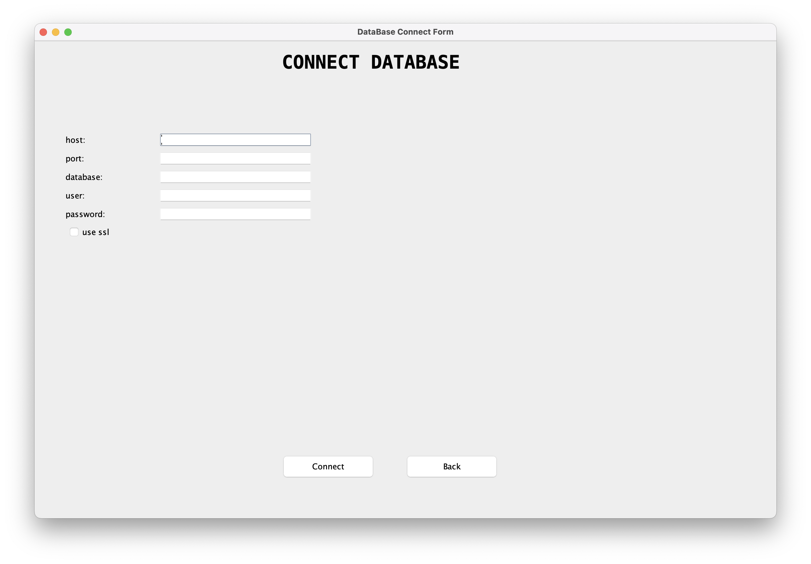
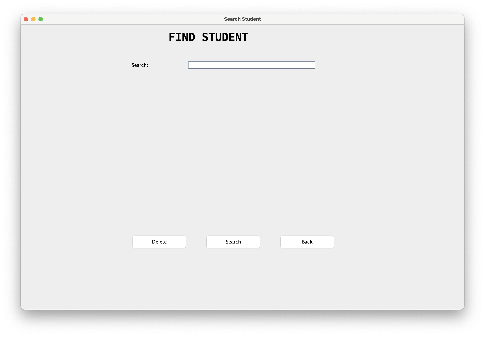
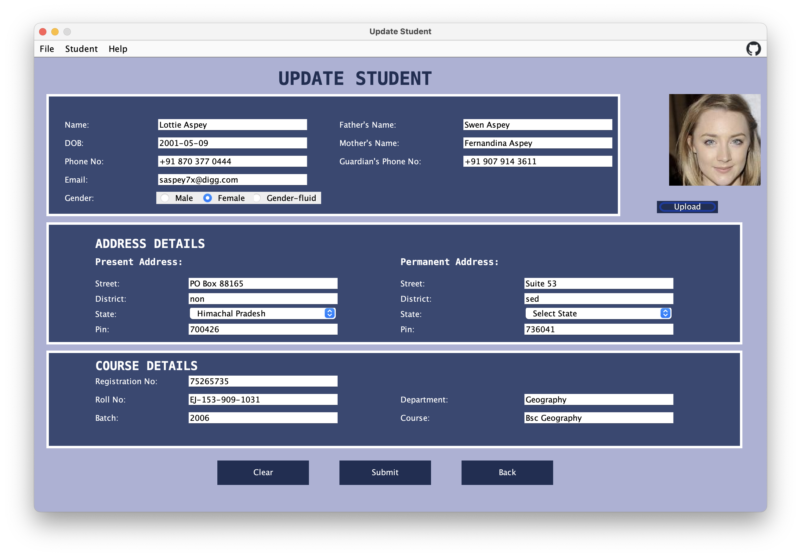

# Uni Manager

This is a simple student management system done using Java and Swing package.

## Screenshots







## Build

To build the app from source, use the following commands:

```bash
    ant
    java  -jar dist/UniManager.jar  
```
