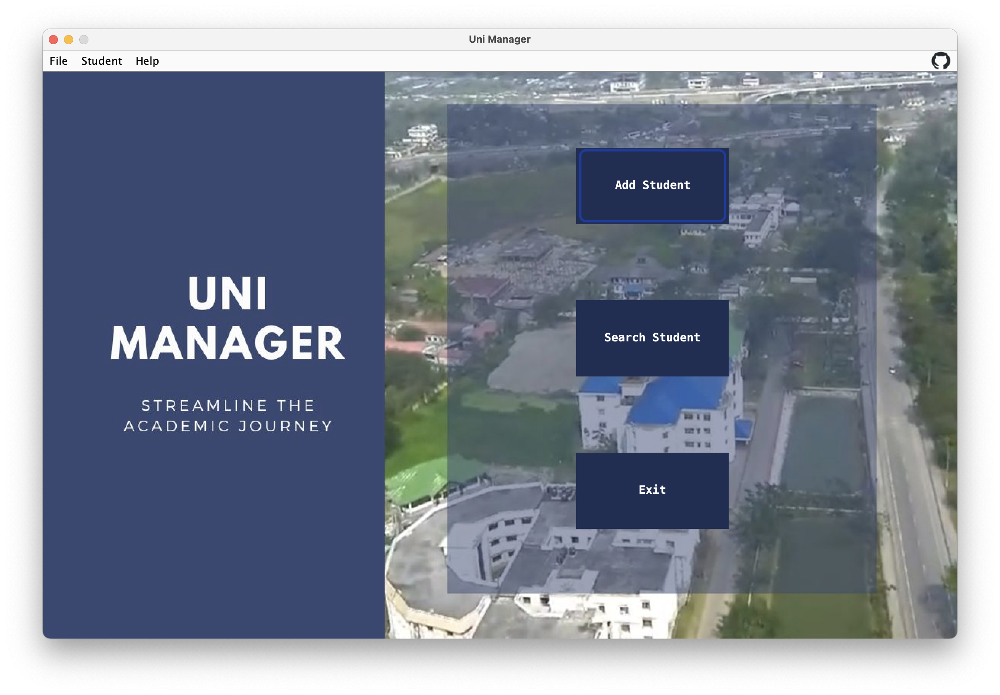
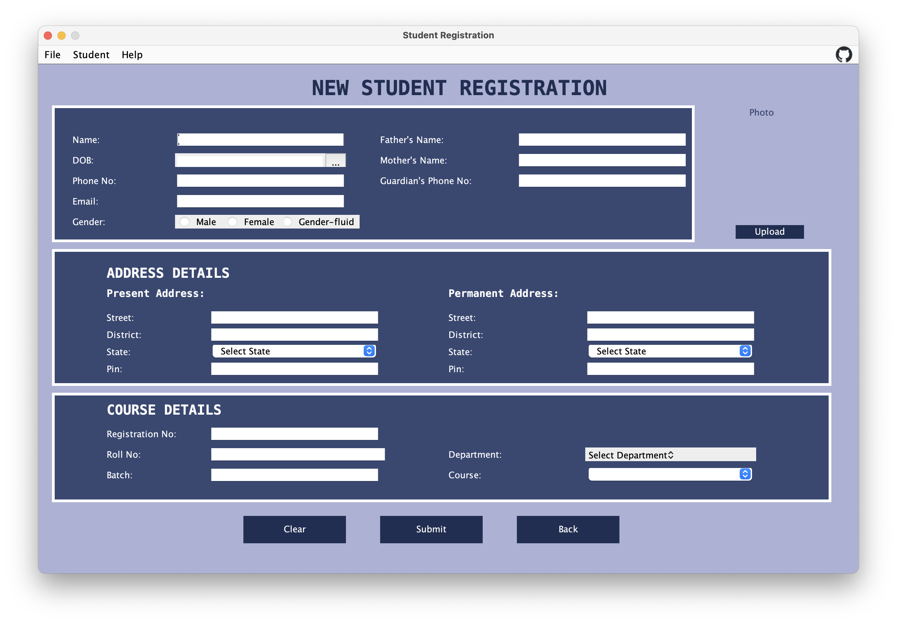
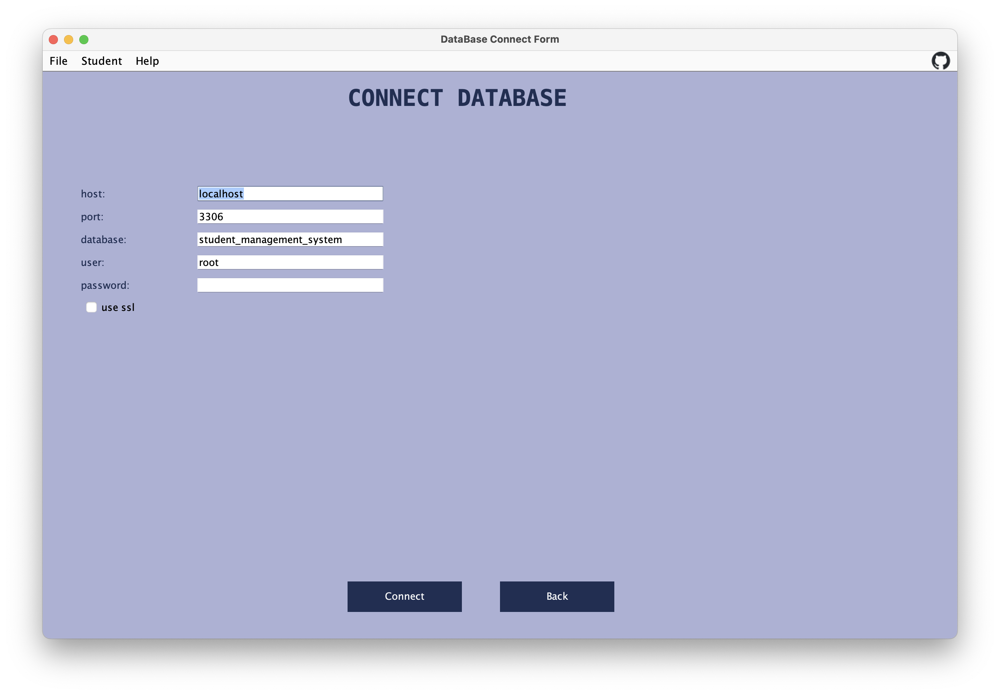
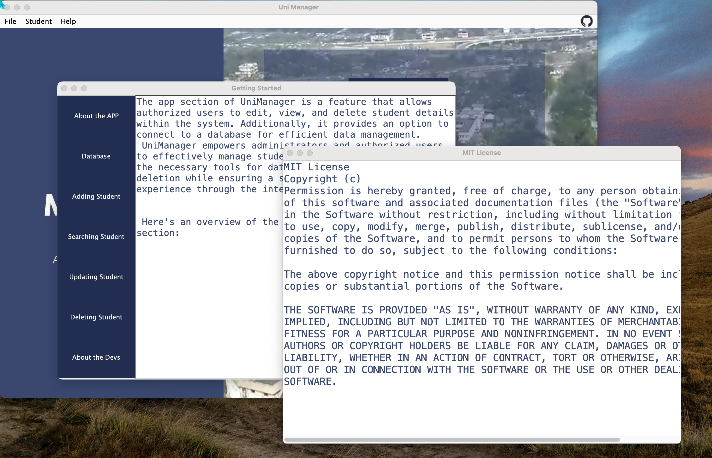

# Uni Manager

This is a simple student management system done using Java and Swing package.

## Features

## Technologies and Dependencies

## Build

To build the app from source, use the following commands:

```bash
    ant
    java  -jar dist/UniManager.jar  
```

## Installation

## Screenshots








## Contributing

Contributions are welcome and encouraged! Here are some guidelines to get you started:

1. Fork the repository and clone it to your local machine.
2. Create a new branch for your feature or bug fix.
3. Make your changes and test thoroughly.
4. Commit your changes with descriptive commit messages.
5. Push your branch to your forked repository.
6. Open a pull request, providing a clear title and description of your changes.
7. Ensure that your code follows the project's coding conventions and style guidelines.
8. Your pull request will be reviewed by the project maintainers. Feedback or suggestions for improvements may be provided.
9. Once approved, your changes will be merged into the main repository.
10. Thank you for your contribution!

## License

This project is licensed under the MIT License. See the [LICENSE](LICENSE) file for more information.
